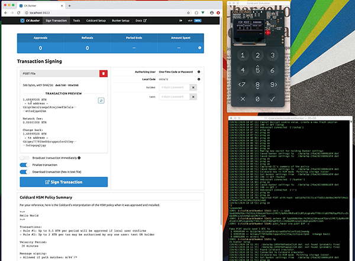

# <i>CKBunker</i>



- [CKBunker preview screencast (youtube)](https://www.youtube.com/watch?v=0bHhZbYOiSM)
- [Usage examples](examples.md) for HSM/CKBunker.
- [Documentation Website](https://ckbunker.com)
- [Github for CKBunker](https://github.com/Coldcard/ckbunker).
psbt.md
- Full docs: [Setup Your Bunker](setup.md), [HSM Policy](policy.md), [PSBT Signing](psbt.md),
  [Message Signing](msg-signing.md), [Contributing Code](hacking.md) 

## What is the Coinkite Bunker?

It's a python program that you run on a computer attached to a
Coldcard. It will setup and operate the Coldcard in "HSM Mode" where
it signs without a human pressing the OK key.  To keep your
funds safe, the Coldcard implements a complex set of spending rules
which cannot be changed once HSM mode is started.

Using the `tord` (Tor deamon) you already have, the CK Bunker can
make itself available as a hidden service for remote access over
Tor.  A pretty website for setup and operation allows access to all
HSM-related Coldcard features, including:

- transaction signing, by uploading a PSBT; can broadcast signed txn using Blockstream.info (onion)
- define policy rules, spending limits, velocity controls, logging policy
- user setup (TOTP QR scan to enroll on Coldcard, or random passwords (Coldcard) or known password

The bunker encrypts its own settings and stores the private key for
that inside Coldcard's storage locker (which is kept inside the
secure element of the Coldcard). The private key for the onion
service, for example, is protected by that key.

## What is Coldcard?

Coldcard is a Cheap, Ultra-secure & Opensource Hardware Wallet for Bitcoin.
Get yours at [ColdcardWallet.com](http://coldcardwallet.com)

Learn more about the [Coldcard HSM-related features](https://coldcardwallet.com/docs/ckbunker-hsm).

[Follow @COLDCARDwallet on Twitter](https://twitter.com/coldcardwallet) to keep up
with the latest updates and security alerts. 

## Check-out and Setup

Do a checkout, recursively to get all the submodules:

    git clone --recursive https://github.com/Coldcard/ckbunker.git

Then:

- `virtualenv -p python3 ENV` (Python 3.7 or higher is required)
- `source ENV/bin/activate` (or `source ENV/bin/activate.csh` based on shell preference)
- `pip install -r requirements.txt`
- `pip install --editable .`

## Usage

The executable is called `ckbunker`:

```sh
$ ckbunker --help
Usage: ckbunker [OPTIONS] COMMAND [ARGS]...

Options:
  -s, --serial HEX  Operate on specific unit (default: first found)
  --help            Show this message and exit.

Commands:
  list     List all attached Coldcard devices
  example  Show an example config file, using the default values
  run      Start the CKBunker for normal operation
  setup    Configure your transaction signing policy, install it and then...
```

There are two modes for the Bunker: "setup" and "run mode". In setup
mode, Tor connections are disabled, as is the login screen. There is no
security and it's meant for initial setup of the Coldcard and Bunker.

You would typically use the setup mode for picking the onion address, the
master login password and all the details of the HSM policy.

```sh
$ ckbunker setup
```

Open this URL in your local web browser (must be same machine):
<http://localhost:9823>

Once the Coldcard is running in HSM mode, with your policy installed,
it makes sense to operate in normal "run" mode. This enables a simple
login screen to keep out visitors:

```sh
$ ckbunker run
```

You may also run with remote connections (and login) disabled. This would be useful
if you have some existing web proxy already in place.

```sh
$ ckbunker --local run
```

## Tor Use

To access over Tor as a hidden service, you must have `tord` running
on the same machine. For desktop systems, keeping TorBrowser open
is enough to acheive this. On servers, start tord with default options,
and ckbunker will use the control port (localhost port 9051 or 9151).

If you use the bunker to broadcast the final (signed) transaction,
the socks proxy of tord (port 9050) will also be used.


## Operational Requirements

You will need:

- this code
- a Mk3 Coldcard connected via USB, running
  [firmware version 3.1.0 or later](https://coldcardwallet.com/docs/upgrade)
- `tord` (Tor program)
- an Internet connection
- a Tor-capable browser, like "Tor Browser" or Tails.
- (optional) a microSD card, for logging of transactions on Coldcard
- (optional, recommended) a mobile phone with TOTP 2FA app, like Google Authenticator or FreeOTP

## FAQ

### Will HSM mode be supported on Mk1 or Mk2?

Sorry no. CK Bunker only works on Mk3 because we need the extra RAM
and the newer features of the 608 secure element.

### What is HSM?

"Hardware Security Module"

Learn more about the [Coldcard in HSM Mode](https://coldcardwallet.com/docs/ckbunker-hsm)

## Quotes

> "Basically the cost of a Bitcoin HSM with custom policies is now the cost of a coldcard and you don't need a thirty party to maintain it." - Francis P.

