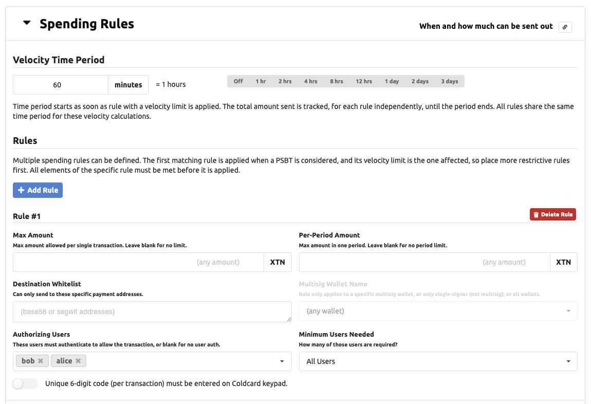
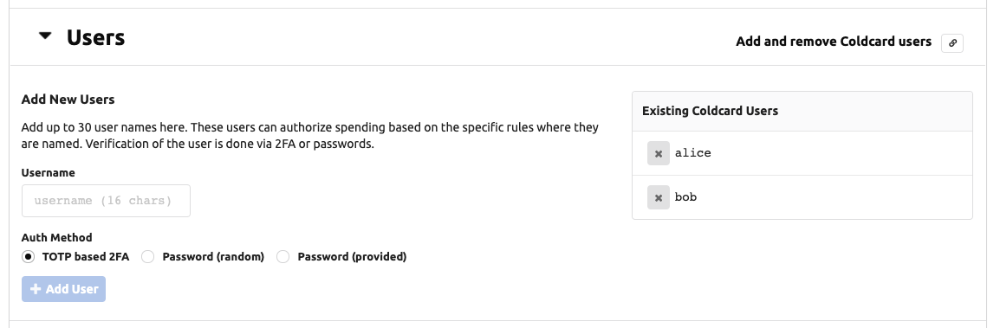
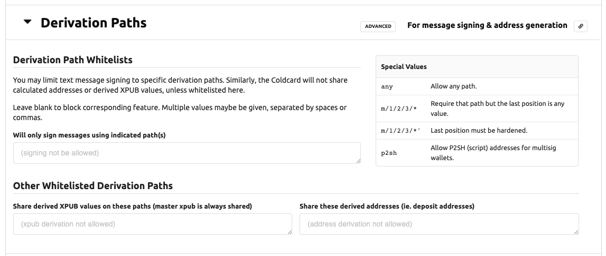
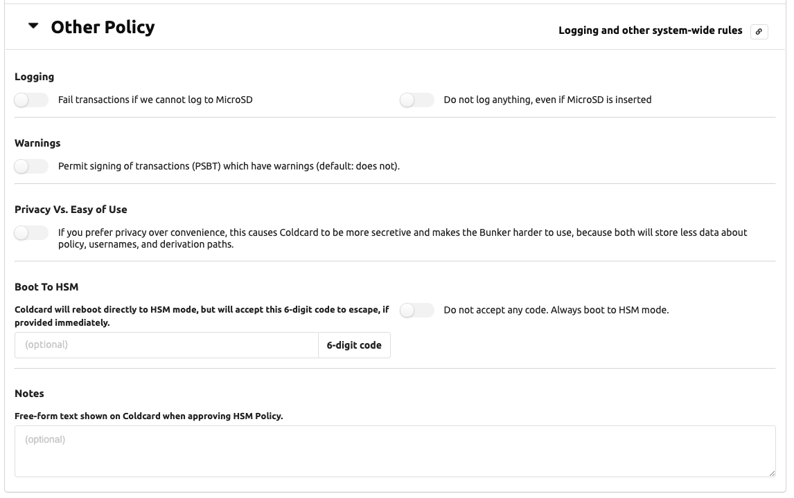

# HSM Policy Config

# Spending Rules

Multiple spending rules can be defined. The system scans the rules
starting from the first one, and will test each rule. The first
rule that is satisfied is applied and following rules are not considered.

We recommend putting the most narrow rules first. Catch-all rules, which 
might move more money should be later in the list.

By combining multiple rules, with diffent restrictions, it's possible
to create a secure and yet flexible policy.

## Velocity Time Period

To implement spending limits based on time, the Coldcard requires you to define
a period. This period, expressed in minutes, applies to all rules. Any rule with
a defined "Per-Period Amount" value, will be affected. 

The period starts when it is first used. There is no absolute concept of
time on the Coldcard because it doesn't have a real time clock. There is only one
period, so it will begin as soon as any rule using a velocity limit
is applied successfully.

At the end of the time period, the totals are reset to zero.

## Individual Rules

Each rule consists of these values, which are all considered at the same time.

- _Max Amount_: max BTC per transaction, that this rule can apply to (independent of period)
- _Per-Period Amount_: total BTC that can move thu this rule in the period
- _Destination Whitelist_: a list of specific addresses which are allowed as destinations
- _Multisig Wallet Name_: either name of a multisig wallet, or
  `1` indicating rule only applies to non-multisig wallets.
- _Authorizing Users_: a list of users that are able to approve the transaction (N)
_ _Minimum Users Needed_:  number of users (M) needed to approve (from list of users
  for this rule, not the system)
- _Local Confirmation Code needed_: a local user must (also) approve (via 6-digits entered on keypad)

When an element of the rule is has no value, then the restriction
does not apply. For example, if _Destination Whitelist_ is empty,
then the Coldcard will not consider the destination address when
considering the rule.

If no rules are defined, then no PSBT will be signed. This can be
useful for text message signing applications. On the other hand,
an empty rule, allows any transaction to be signed, so be careful!

### Max Transaction Amount 

Max amount per transaction is seems less useful because a number of transactions
could be put together to "work around" this rule. However, if there is natural
rate-limiting in your system, for example, by requiring a
local operator to enter a code eeach time, then this is still helpful.

### Authorizing Users

You can list username in the `users` field. If defined the `min_users` controls
how many of those are required. By default (if `min_users` isn't defined), all users
listed must confirm the operation. You can achieve 2-of-5 and similar setups
using `min_users`. All users listed must already be defined on the Coldcard
before the policy is activated.

### Limit to Named Wallet

The `wallet` field can be omitted, or set to the  name of a multisig wallet. If set
to the string `1`, it indicates this rule only applies to the non-multisig wallet.

### Destination Whitelist

You may specify a list of addresses in the whitelist field. The Coldcard will
only apply the rule if all destination addresses of the PSBT transaction are
included in the whitelist. This is a powerful feature when your target wallets
that you control, such as emergency cold wallets.

# User Management

To support use of the Coldcard in HSM mode, the Coldcard can hold
usernames and their shared secrets for authentication purposes. At
present, this is only useful for use in HSM mode.  The user's login
data (secrets) are stored exclusively on the Coldcard, and are never
stored in the CKBunker.

Two methods are offered: shared password (ie. classic "something
you know") or TOTP (time-based one-time pass) 2FA authentication,
compatible with [RFC6238](https://tools.ietf.org/html/rfc6238). Most
people will already have an app on their mobile phone to hold
the shared secrets and simplify the number-calculating process.

Creating new users can **only** be done over USB protocol with the
help of CKBunker or `ckcc` programs. However, once the user is
established, you may view it and remove them from the menu system
on the Coldcard, in the Advanced menu, under "User Management".

The best practice is for the Coldcard to generate the password or
TOTP secret and display it on-screen in a QR code. If you are using
a TOTP app, such as Google Authenticator or FreeOTP, then you can
scan the screen of the Coldcard to install the code. Unfortunately,
due to limited screen space, there isn't room for the meta data
such as username or specific Coldcard number: your app will only
show "CC".

It is possible to send a user-provided password over USB, in which
case, the QR code is not shown. This requires trust of the attached
computer during this operation, and so we do not recommend it.

Click the (X) beside a username to remove it. This will invalid your
HSM policy if that user is involved with a rule. You'll need to change
the rule, or create a new user with the old name.

# Derivation Paths

This section controls message signing and derivation paths allowed for
sharing addresses and derived xpubs.

## Message Signing

To enable text message signing, list one or more BIP32 derivation paths in this section.
You can use the special value `any` to allow all signing. You may also use a star
in the last position of a path, like these examples:

- `m/84'/0'/0/*`
- `m/84'/0'/0'/*'`
- `m/9984/*`

The star allows any number in the final position (only). It does not allow deeper paths.

## Sharing Xpubs

The Coldcard can calculate XPUB values for derived paths, if desired.
You can limit this feature by giving a list of permitted paths, or
the keyword `any` to allow any subpath.  The master xpub (`m`)
is always available over USB protocol and cannot be disabled.

## Share Derived Addresses

Similarly, the Coldcard can calculate wallet addresses, if this
setting contains a list of whitelisted derivation paths. Star
patterns, and the keyword `any` can be used, as well as the keyword
`p2sh` which allows addresses in multisig wallets to be shared.

In the case of multisig wallets, we do not check the script provided,
beyond the normal checks for inclusion into a known multisig wallet.

# Other Policy

This section covers global policy choices. Most settings are simple booleans.

## Logging to MicroSD Card

Two setting affect logging: _Must log_ and _Never log_. By default,
the Coldcard will log if a card is inserted. It does not fail if
the card is missing. If that is an issue for you, then set _Must log_
and transactions will be refused if the card isn't installed and
working. _Never log_ is useful when you don't want to keep records
at the Coldcard's location.

## Warnings Okay?

This boolean allows the Coldcard to sign PSBT files that have
warnings. Typically warning are generated by overly-large fees or
weird path derivations. Since we don't expect warnings, any
transactions with a warning is normally refused.

## Privacy over UX

During development of the Bunker, we found there were numerous
status and informational values being shared over USB that, to some
degree, assist potential attackers. However, those values are needed
to provide a usable interface and a nice user experience (UX).

If you set _Privacy over UX_, the following values will not be
shared over [USB in the HSM status response](protocol):

- text summary of the spending policy
- count of approvals / refusals
- the number of time the storage locker has been read
- the period length
- when the period will end
- how much each rule has spent in current period
- system uptime
- list of usernames
- number of users which have provided auth credentials for current PSBT

The CKBunker can operate in either mode, but you will find it harder
to use, as it's not possible to know where you stand in terms of 
velocity spending and user authorization. 

## Boot to HSM

This feature forces the Coldcard to start in HSM mode immediately
after boot up (after entry of the master PIN).

You specify a 6-digit numeric code and if that code is provided in
the first 30 seconds after startup, the Coldcard will leave HSM
mode. (The HSM policy file is erased in this process, and the
Red/green LED will be left as Red.) Alternatively, you may
set _Do not accept any code_, and the Coldcard can never leave HSM mode.

!!! warning "Bricking Hazard"

    No changes to firmware, HSM policy, Coldcard settings will be possible&mdash;ever again.

    Not even the master PIN holder can change HSM policy nor escape HSM
    mode! Firmware upgrades are not possible.

Boot-to-HSM is mainly useful mainly if the local operator does not
have the authority to spend the funds, but does know the PIN code
so they can assist with powerfail restart. In most applications, we
expect someone with PIN knowledge and also the spending authority
to power-up and enable HSM mode.

## Notes

This is simply free-form text shown on the Coldcard when approving HSM Policy.
Up to 80 characters allowed. You could put the master password and/or
onion address here for documentation purposes.

# Save and Start Policy

When you are happy with your HSM policy, press "Save and Start
Policy". You may want to capture a copy of the settings for later
use. The CKBunker does not save the details (but may same a text
summary) so it cannot re-create the policy rules completely.  Coldcard
saves the details but does not offer a means to share them later.

Once you've hit the button, the attached Coldcard will prompt you for
approval. You will get to see the policy as the Coldcard understands it,
and you should read that careful to confirm it matches you intentions.

After final approval, the HSM policy file is written into the
Coldcard's flash memory and it enters HSM mode. On subsequent
reboots, you will be prompted to start HSM mode on each time.

# Next Steps

[Signing a PSBT file](psbt.md)

