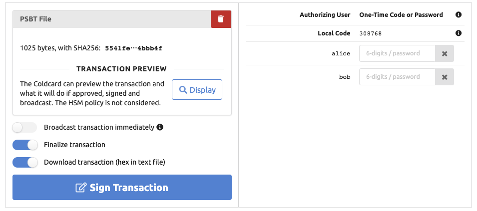
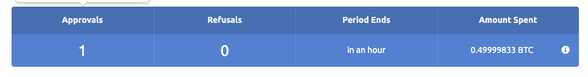
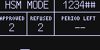
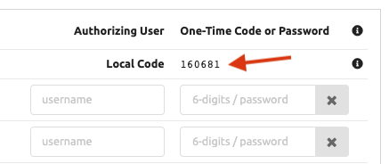
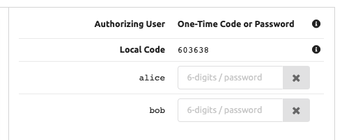

# Daily Operation: Signing PSBT Files

## PSBT Files

You need to construct the PSBT file on another system.
The CKBunker does not track the blockchain or know your UTXO. We will not make
any assumptions about how you create PSBT files, and there are a growing number of
wallets that can do it: BitcoinCore and Electrum for example.

For testing purposes, we recommend
[`psbt_faker`](https://github.com/Coldcard/psbt_faker) which will
take your XPUB, and make arbitrary fake transactions immediately
suitable for signing as PSBT files.
This is a good way to test your policy choices with specific values and other what-ifs.

## Sign Transaction Tab

Select "Sign Transaction" from the top bar, and you will see something similar to this:


The top is status dashboard, showing details of the Coldcard's current state. Hover
over those fields for additional detail, such as a breakdown of spending per rule.

At the bottom, a text summary, original from the Coldcard, shows the current
policy in effect. For this example, the policy is as follows:

```text
Transactions:
- Rule #1: Up to 1 XTN per period will be approved
- Rule #2: Any amount will be approved if local user confirms

Velocity Period:
 60 minutes
 = 1 hrs

Message signing:
- Allowed if path matches: (any path)

Other policy:
- MicroSD card will receive log entries.
- Storage Locker will be updated, and can be read 13 times.
```

The next step is to upload a PSBT file. Binary, hex or base64 encoded files are
accepted. When you've done that, the screen will change:



If you want to know what the PSBT transaction will do, based on the Coldcard's
understanding of it, press the "Display" button. The PSBT is sent to the Coldcard,
and the text summary of what it does will be shown on your web browser. This is
the same text that would be shown on-screen if the Coldcard was not in HSM mode.


Depending on your goals, there are three toggles to consider now:

- Broadcast transaction immediately: CKBunker will send the finalized transaction to the
    Bitcoin P2P network for possible inclusion in the next block. Implies finalize.
- Finalize transaction: In addition to PSBT signing, ask the Coldcard to finalize
    the transaction. Resulting file will be hex, ready for broadcast.
- Download signed PSBT or transaction. Send the file to your browser immediately. You may not
    need the file if it's broadcast already.

Adjust those to your needs, and press "Sign Transaction".

If the transaction is acceptable to the policy, then it will be
signed and broadcast directly, and/or downloaded to your browser.

The dashboard updates immediately after signing, and in this case, shows the
updated velocity limits.



## Local User Confirmation Code

The only local physical interaction possible with a Coldcard in HSM
mode is to enter a local authorization code. This can be required
by specific HSM policy rules, but is completely optional.

As the local operator enters the 6-digit numeric code, the digits
are shown in the top right corner of the screen. Press OK to apply
them, or X to clear and start over. Codes are always 6 digits. There
is no indication the code worked or failed, in part because it isn't
tested until the PSBT is given for signing, which could be some
time later.



The required code is a combination of the specific bytes
of the PSBT file being approved, and also a salt value picked by
the Coldcard.

When the PSBT file has been uploaded, use the CKBunker updates the local code:



How you get this code into the Coldcard left to you. Please note
the local operator must enter the code _before_ you press the "Sign Transaction"
button on the CKBunker.

A different code will be required for each attempted signing (because
Coldcard changes the salt value) and for every PSBT file (because
the hash of the PSBT is a factor in this number).

## User Authorization

Depending on your configuration, you may see a number of username/password
fields, in the top right area.



Enter the TOTP 2FA code (6 digits) from your app. If you are using
passwords, enter that instead. If you have enabled "Privacy
over UX", you will need to enter the username on the left side as well.
Obviously, both the username and password must be correct.

When you press "Sign Transaction", all the OTP/password data you
have entered is submitted before the PSBT is considered by the
Coldcard. If do you provide codes/passwords, they must be right, or
the Coldcard will not proceed. When values are omitted (left blank)
then it is not an error, but of course, rules that require the
user's authorization will not be accepted.

## "Meet Me In The Bunker" Usage Case

When multiple people need to authorize a transaction, they can all
meet in the bunker: each user, from anywhere in the world, connects
to the Bunker via Tor. Each will see the same state on the _Sign Transaction_ page.
One can can upload a transaction (PSBT) and
press the visualize button. All the screens update at the
same time. When each person is satisfied, they may enter their OTP code
or password to help approve the transaction. The other users will
see this happening in real time.

The CKBunker stores the current PSBT under consideration in RAM,
so there is no need for this interaction to happen simultaneously.
Users can come and go as needed to complete this process serially.

# Next Steps

[Msg Signing](msg-signing.md)
